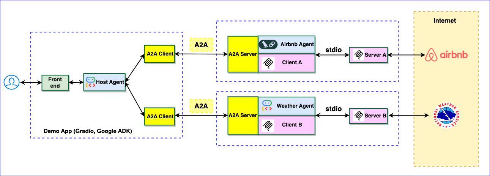

# Build Multi-Agent Systems using A2A SDK

----
> **⚠️ DISCLAIMER**: THIS DEMO IS INTENDED FOR DEMONSTRATION PURPOSES ONLY. IT IS NOT INTENDED FOR USE IN A PRODUCTION ENVIRONMENT.
>
> **⚠️ Important:** A2A is a work in progress (WIP) thus, in the near future there might be changes that are different from what demonstrated here.
----

This repository contains a complete, runnable demonstration of an Agent2Agent (A2A) deployment that combines Google ADK components, LangGraph orchestration, and Model Context Protocol (MCP) style remote agents. A host agent mediates user requests, consulting a weather specialist before forwarding lodging questions to an Airbnb-focused agent. The project ships with a Gradio front end so you can explore the full workflow locally.



## Repository layout

* `src/host_agent/` – LangGraph-driven host that enforces the travel safety policy and serves the Gradio UI.
* `src/airbnb_agent/` – Remote lodging specialist exposed as an A2A server backed by the OpenAI API.
* `src/weather_agent/` – Remote weather specialist implemented with the A2A server stack and OpenAI.
* `tests/` – Unit tests covering the routing graph and policy logic.

## Prerequisites

* Python 3.10 or newer (the project is tested with Python 3.13).
* [uv](https://docs.astral.sh/uv/) or pip for dependency management.
* An [OpenAI API key](https://platform.openai.com/account/api-keys) exported as `OPENAI_API_KEY` for the remote agents.

## Install dependencies

```bash
uv venv
source .venv/bin/activate
uv pip install -r requirements.txt
```

If you prefer pip, replace the last line with `pip install -r requirements.txt`.

## Environment configuration

Create a `.env` file in the repository root so every service shares the same settings:

```bash
OPENAI_API_KEY="sk-your-key"

# Optional overrides for the models used by each agent
# OPENAI_MODEL="gpt-4o-mini"
# OPENAI_AIRBNB_MODEL="gpt-4o-mini"
# OPENAI_WEATHER_MODEL="gpt-4o-mini"

# Host agent connections to the remote specialists
AIR_AGENT_URL="http://localhost:10002"
WEA_AGENT_URL="http://localhost:10001"

# Optional: publish agent cards behind a different URL
# APP_URL="https://your-public-url"
```

## Run the agents

Start each service in its own terminal from the project root (or use the provided Makefile targets).

1. **Weather specialist**
   ```bash
   python -m src.weather_agent
   # equivalent Makefile helper: make weather_agent
   ```
2. **Airbnb specialist**
   ```bash
   python -m src.airbnb_agent
   # Makefile helper: make airbnb_agent
   ```
3. **Host agent + UI**
   ```bash
   python -m src.host_agent
   # Makefile helper: make host_agent
   ```

The host launches a Gradio chat UI on <http://127.0.0.1:11000>. Example prompts:

* "Tell me about weather in LA, CA"
* "Please find a room in LA, CA, June 20-25, 2025, two adults"

Behind the scenes the host agent:

1. Classifies the request with a deterministic policy.
2. Contacts the weather specialist and records the forecast.
3. Blocks or allows Airbnb suggestions based on hazardous conditions.
4. Streams the combined reasoning back to the user.

## Testing

```bash
python -m pytest
```

## References

- <https://github.com/google/a2a-python>
- <https://codelabs.developers.google.com/intro-a2a-purchasing-concierge#1>
- <https://google.github.io/adk-docs/>

## Disclaimer

Important: The sample code provided is for demonstration purposes and illustrates the mechanics of the Agent-to-Agent (A2A) protocol. When building production applications, it is critical to treat any agent operating outside of your direct control as a potentially untrusted entity.

All data received from an external agent—including but not limited to its AgentCard, messages, artifacts, and task statuses—should be handled as untrusted input. For example, a malicious agent could provide an AgentCard containing crafted data in its fields (e.g., description, name, skills.description). If this data is used without sanitization to construct prompts for a Large Language Model (LLM), it could expose your application to prompt injection attacks.  Failure to properly validate and sanitize this data before use can introduce security vulnerabilities into your application.

Developers are responsible for implementing appropriate security measures, such as input validation and secure handling of credentials to protect their systems and users.
